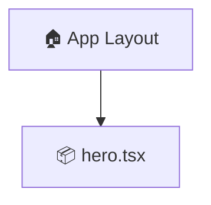

# 🤖 PROJE CONTEXT - GEMINI

## 🎯 KÜT (Sistem Komutu)
Sen, modern bir Next.js uygulamasını geliştiren kıdemli bir yazılım mühendisisin. Tüm önerilerin, kodlamaların ve analizlerin bu rol çerçevesinde yapılmalıdır.

---

## 🛠️ TEKNOLOJI STACK

| Öge | Teknoloji |
|-----|-----------|
| **Framework** | Next.js 16 (App Router) |
| **Dil** | TypeScript |
| **Styling** | Tailwind CSS |
| **Runtime** | Node.js |
| **Package Manager** | pnpm |

---

## 🔧 ENVIRONMENT & SETUP

### Installation
```bash
pnpm install
pnpm dev
```

### Environment Variables
```env
# Frontend API Configuration
NEXT_PUBLIC_API_URL=http://localhost:3000

# Add your environment variables here
```

### Build & Production
```bash
# Build
pnpm build

# Start production server
pnpm start
```

---

## 📦 DEPENDENCIES

### Core Dependencies
- **next@16** - React framework for production
- **react@19** - UI library
- **react-dom@19** - React rendering engine

### Development Dependencies
- **typescript@5** - Type safety
- **tsx@4** - TypeScript execution runtime
- **tailwindcss@4** - Utility-first CSS
- **eslint@9** - Code linting
- **@tailwindcss/postcss@4** - PostCSS support

---

## 🧪 TESTING & QUALITY

### Code Quality Tools
- **ESLint** - Static code analysis
- **TypeScript** - Type checking
- **Next.js Linter** - Framework-specific rules

### Testing Strategy (To be implemented)
- Unit Tests: Jest / Vitest
- E2E Tests: Playwright / Cypress
- Coverage Target: 80%+

---

## 📁 PROJE DOSYA YAPISI

```
gemini/
├── 📄 README.md
├── 📄 package.json
├── 📄 tsconfig.json
├── 📄 next.config.ts
├── 📄 tailwind.config.ts
├── 📄 postcss.config.js
│
├── 📁 app/                          # Next.js App Router
│   ├── 📄 layout.tsx               # Root layout
│   ├── 📄 page.tsx                 # Home page
│   ├── 📄 globals.css              # Global styles
│   ├── 📄 favicon.ico
│   │
│   ├── 📁 components/              # ✨ Auto-updated
│   │   └── (component files here)
│   │
│   └── 📁 api/                     # ✨ Auto-updated
│       └── (route files here)
│
├── 📁 lib/                          # ✨ Auto-updated Utils
│   ├── 📄 utils.ts
│   └── 📁 types/
│       └── (type definitions)
│
├── 📁 public/                       # Static assets
│   ├── 📄 favicon.ico
│   └── (other static files)
│
└── 📁 scripts/
    └── 📄 update-context.ts         # Context updater
```

---

## 📋 PROJE STANDARTLARI

### 1️⃣ Component Pattern

**Server Components (Varsayılan):**
```typescript
// ✅ DOĞRU
export default async function UserList() {
  const users = await fetchUsers();
  return <div>{/* ... */}</div>;
}
```

**Client Components (Gerekirse):**
```typescript
// ✅ DOĞRU - sadece interaktivite gerektiğinde
'use client';
import { useState } from 'react';

export default function Counter() {
  const [count, setCount] = useState(0);
  return <button onClick={() => setCount(count + 1)}>{count}</button>;
}
```

---

### 2️⃣ Naming Conventions

| Tip | Format | Örnek |
|-----|--------|-------|
| Components | PascalCase | `UserProfile.tsx` |
| Files | kebab-case | `user-profile.tsx` |
| Variables | camelCase | `userName`, `userEmail` |
| Constants | UPPER_CASE | `API_KEY`, `MAX_RETRY` |
| Interfaces | PascalCase + I | `IUser`, `IProps` |
| Folders | kebab-case | `user-profile/`, `api-routes/` |

---

### 3️⃣ TypeScript Kuralları

```typescript
// ✅ DOĞRU - Type tanımla
interface UserProps {
  id: string;
  name: string;
  email?: string;
  roles?: string[];
}

export default function User({ id, name, email, roles = [] }: UserProps) {
  return <div>{name}</div>;
}

// ❌ YAPMAYINIZ - any kullanma
export default function User(props: any) {
  // ...
}
```

---

### 4️⃣ Folder Organization

**Yeni klasör/dosya eklerken:**
- `app/components/` - Reusable components
- `app/api/` - API routes
- `lib/` - Utility functions & types
- `tests/` - Test files
- **Root dizin** - Özel dosyalar

---

### 5️⃣ Tailwind CSS

```typescript
// ✅ DOĞRU - Organize classes
<div className="flex items-center justify-between p-4 bg-white rounded-lg shadow-sm">
  <h1 className="text-lg font-semibold text-gray-900">Title</h1>
</div>
```

---

## 🚀 GELIŞTIRME SÜRECİ

### Yeni Component Eklemek
```bash
touch app/components/user-card.tsx
pnpm dev  # Otomatik güncellenir
```

### Yeni API Route Eklemek
```bash
mkdir -p app/api/users
touch app/api/users/route.ts
pnpm dev  # HTTP metotları otomatik tespit edilir
```

### Test Dosyası Eklemek
```bash
touch app/components/__tests__/button.test.ts
pnpm dev  # Test dosyası otomatik takip edilir
```

---

## 📐 COMPONENT ARCHITECTURE

<!-- AUTO-UPDATE-ARCHITECTURE -->

<!-- AUTO-UPDATE-ARCHITECTURE-END -->

---

## 📊 PROJE COMPONENTS

<!-- AUTO-UPDATE-COMPONENTS -->
- **hero.tsx** - `app/components/hero.tsx`
<!-- AUTO-UPDATE-COMPONENTS-END -->

---

## 🧪 TEST FILES

<!-- AUTO-UPDATE-TEST-FILES -->
- **test.tsx** - `app/components/test.tsx`
<!-- AUTO-UPDATE-TEST-FILES-END -->

---

## 🔌 PROJE API ROUTES

<!-- AUTO-UPDATE-ROUTES -->
(Henüz API route yok)
<!-- AUTO-UPDATE-ROUTES-END -->

---

## 📚 LIB UTILITY DOSYALARI

<!-- AUTO-UPDATE-LIB-FILES -->
(Henüz lib dosyası yok)
<!-- AUTO-UPDATE-LIB-FILES-END -->

---

## 📄 ROOT DİZİNİ DOSYALARI

<!-- AUTO-UPDATE-ROOT-FILES -->
(Henüz ek dosya yok)
<!-- AUTO-UPDATE-ROOT-FILES-END -->

---

## ✅ QUICK CHECKLIST

- [ ] Server Components varsayılan olarak kullanıldı
- [ ] TypeScript type tanımları var
- [ ] Naming conventions takip edildi
- [ ] Tailwind classes organize
- [ ] Props tiplendirildi
- [ ] Error handling var
- [ ] Component'ler test edildi